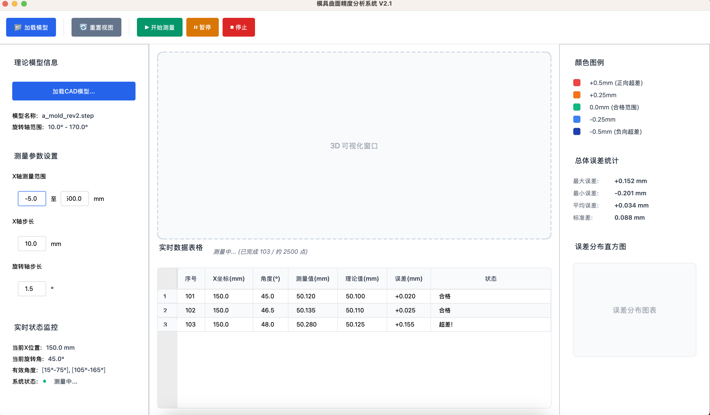

# 模具曲面精度分析系统

一个基于 Python 和 PySide6 开发的桌面应用程序，用于加载理论CAD模型信息和实时测量数据，通过对比分析两者差异来计算和可视化模具的表面精度误差。

## �️ 界面预览



*系统主界面：三栏布局设计，左侧为参数设置，中央为3D可视化，右侧为数据统计*

## �🚀 快速开始

### 环境要求

- Python 3.8+
- conda 环境管理器
- 已创建的 pyside-env 环境，包含 PySide6

### 安装和运行

1. **激活 conda 环境**
   ```bash
   conda activate pyside-env
   ```

2. **安装依赖**
   ```bash
   pip install -r requirements.txt
   ```

3. **运行应用程序**
   ```bash
   python app.py
   ```
   或使用便捷脚本：
   ```bash
   ./run.sh
   ```

## ✨ 核心功能

- **理论模型管理**: 支持加载和管理CAD模型文件
- **实时测量控制**: 提供测量参数设置和过程控制
- **数据可视化**: 实时显示测量数据和误差分析
- **统计分析**: 提供误差统计和分布图表
- **现代化界面**: 采用现代化设计，界面清晰美观

## 📁 项目结构

```
mold-surface-inspector/
├── app.py                 # 应用程序启动入口
├── main_window.py         # 主窗口类实现
├── config.py              # 配置管理模块
├── styles.py              # QSS样式管理模块  
├── data_manager.py        # 数据管理模块
├── test_functions.py      # 功能测试脚本
├── comprehensive_test.py  # 综合测试脚本
├── requirements.txt       # 项目依赖
├── install.sh             # 环境安装脚本
├── run.sh                 # 便捷运行脚本
├── 页面 1.html           # UI原型参考
└── docs/                  # 📚 完整文档目录
    ├── README.md          # 详细项目说明
    ├── QUICK_START.md     # 快速上手指南
    ├── DEV_GUIDE.md       # 开发指南
    ├── API_REFERENCE.md   # API参考手册
    ├── ARCHITECTURE.md    # 技术架构文档
    ├── FUNCTIONS.md       # 功能详细说明
    ├── TROUBLESHOOTING.md # 故障排除指南
    ├── DOC_INDEX.md       # 文档导航索引
    └── CHANGELOG.md       # 更新日志
```

## 📚 文档导航

本项目提供了完整的开发文档体系，帮助不同需求的开发者快速上手：

### 🎯 新手必读
- **[⚡ 快速上手指南](docs/QUICK_START.md)** - 15分钟快速了解项目
- **[🏠 项目功能说明](docs/FUNCTIONS.md)** - 详细的功能特性介绍
- **[📚 完整项目说明](docs/README.md)** - 更详细的项目介绍

### 🔧 开发人员
- **[📚 完整开发文档](docs/DEV_GUIDE.md)** - 全面的开发指南和规范
- **[📖 API 参考手册](docs/API_REFERENCE.md)** - 详细的类和方法说明
- **[🏗️ 技术架构文档](docs/ARCHITECTURE.md)** - 系统架构和设计决策

### 🔧 维护支持
- **[🛠️ 故障排除指南](docs/TROUBLESHOOTING.md)** - 常见问题和解决方案
- **[📋 更新日志](docs/CHANGELOG.md)** - 版本更新记录
- **[📖 文档导航](docs/DOC_INDEX.md)** - 完整文档索引

### 🎯 按需阅读建议

| 你的角色 | 推荐阅读顺序 |
|---------|-------------|
| **新接手开发者** | README → [QUICK_START](docs/QUICK_START.md) → [DEV_GUIDE](docs/DEV_GUIDE.md) → [API_REFERENCE](docs/API_REFERENCE.md) |
| **功能了解者** | README → [FUNCTIONS](docs/FUNCTIONS.md) |
| **架构设计者** | README → [ARCHITECTURE](docs/ARCHITECTURE.md) → [DEV_GUIDE](docs/DEV_GUIDE.md) |
| **API使用者** | [API_REFERENCE](docs/API_REFERENCE.md) → [QUICK_START](docs/QUICK_START.md) |
| **运维人员** | README → [TROUBLESHOOTING](docs/TROUBLESHOOTING.md) |

## 🎯 技术特点

- **面向对象设计**: 使用 OOP 方式组织代码结构
- **模块化架构**: 清晰的功能模块划分
- **响应式布局**: 支持窗口大小调整
- **现代化样式**: 使用 QSS 样式表美化界面
- **中文界面**: 完全支持中文显示和注释

## 📄 许可证

本项目采用 MIT 许可证。

## 🤝 贡献

欢迎提交 Issues 和 Pull Requests！

---

> 💡 **提示**: 如需详细了解项目功能和开发指南，请查看 [docs/](docs/) 目录下的完整文档。