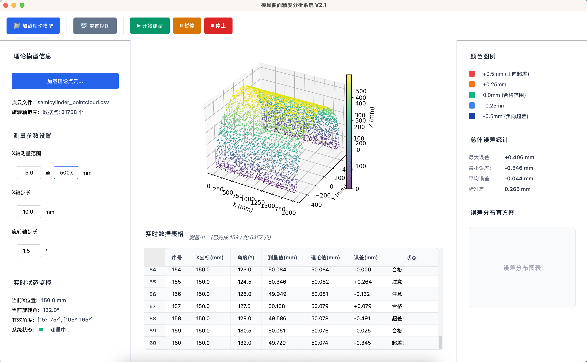

# 模具曲面精度分析系统

一个基于 Python 和 PySide6 开发的桌面应用程序，用于加载理论CAD模型信息和实时测量数据，通过对比分析两者差异来计算和可视化模具的表面精度误差。

## �️ 界面预览



*系统主界面：三栏布局设计，左侧为参数设置，中央为3D可视化，右侧为数据统计*

## �🚀 快速开始

### 环境要求

- Python 3.8+
- conda 环境管理器
- 创建 inspector conda 环境，包含 PySide6

### 安装和运行

1. **激活 conda 环境**
   ```bash
   conda activate inspector
   ```

2. **安装依赖**
   ```bash
   pip install -r requirements.txt
   ```

3. **运行应用程序**
   ```bash
   python app.py
   ```
   或使用启动脚本：
   ```bash
   ./launch.sh
   ```

## 🎯 使用流程

1. **加载理论数据**: 点击"📁 加载模型"，选择 `data/semicylinder_pointcloud.csv`
2. **设置测量参数**: 在左侧面板配置X轴范围、步长等参数  
3. **开始测量模拟**: 点击"▶ 开始测量"启动硬件模拟和误差分析
4. **实时查看结果**: 观察3D可视化、数据表格和统计图表的实时更新
5. **控制测量过程**: 使用暂停/停止按钮控制测量流程

## ✨ 核心功能

- **理论模型管理**: 支持加载CSV格式的理论点云数据文件
- **硬件模拟测量**: 通过 `HardwareSimulator` 类模拟测量设备的数据采集过程
- **实时误差分析**: 使用 `AnalysisWorker` 线程实时计算测量误差和统计数据  
- **3D数据可视化**: 实时显示理论点云和测量点的3D分布图
- **统计图表**: 提供误差分布直方图和实时统计数据更新
- **多线程架构**: 使用QThread实现非阻塞的数据处理和界面更新
- **现代化界面**: 采用PySide6和QSS样式，界面美观易用

## 📁 项目结构

```
mold-surface-inspector/
├── app.py                   # 应用程序启动入口
├── main_window.py          # 主窗口类实现 - 核心UI逻辑
├── hardware_simulator.py  # 硬件模拟器 - QThread测量设备模拟
├── analysis_worker.py      # 误差分析工作线程 - 实时数据处理
├── config.py               # 配置管理模块
├── styles.py               # QSS样式管理模块  
├── data_manager.py         # 数据管理模块
├── generate_semicylinder.py # 半圆柱点云数据生成工具
├── test_simulation.py      # 硬件模拟测试脚本
├── test_functions.py       # UI功能测试脚本
├── comprehensive_test.py   # 综合测试脚本
├── requirements.txt        # 项目依赖配置
├── install.sh              # 环境安装脚本
├── run.sh                  # 便捷运行脚本
├── launch.sh              # 应用启动脚本
├── data/                   # 理论数据存储目录
│   └── semicylinder_pointcloud.csv
├── measurement_data/       # 测量数据输出目录
├── test_output/           # 测试输出目录
├── figures/               # 界面截图和图表
└── docs/                  # 📚 完整文档目录
    ├── README.md          # 详细项目说明
    ├── QUICK_START.md     # 快速上手指南
    ├── DEV_GUIDE.md       # 开发指南
    ├── API_REFERENCE.md   # API参考手册
    ├── ARCHITECTURE.md    # 技术架构文档
    ├── FUNCTIONS.md       # 功能详细说明
    ├── TROUBLESHOOTING.md # 故障排除指南
    ├── DOC_INDEX.md       # 文档导航索引
    ├── CHANGELOG.md       # 更新日志
    └── USER_COMMANDS.md   # 用户命令记录
```

## 📚 文档导航

本项目提供了完整的开发文档体系，帮助不同需求的开发者快速上手：

### 🎯 新手必读
- **[⚡ 快速上手指南](docs/QUICK_START.md)** - 15分钟快速了解项目
- **[🏠 项目功能说明](docs/FUNCTIONS.md)** - 详细的功能特性介绍
- **[📚 完整项目说明](docs/README.md)** - 更详细的项目介绍

### 🔧 开发人员
- **[📚 完整开发文档](docs/DEV_GUIDE.md)** - 全面的开发指南和规范
- **[📖 API 参考手册](docs/API_REFERENCE.md)** - 详细的类和方法说明
- **[🏗️ 技术架构文档](docs/ARCHITECTURE.md)** - 系统架构和设计决策

### 🔧 维护支持
- **[🛠️ 故障排除指南](docs/TROUBLESHOOTING.md)** - 常见问题和解决方案
- **[📋 更新日志](docs/CHANGELOG.md)** - 版本更新记录
- **[📖 文档导航](docs/DOC_INDEX.md)** - 完整文档索引

### 📋 项目跟踪
- **[📝 用户命令记录](docs/USER_COMMANDS.md)** - 项目发展历程和需求跟踪

### 🎯 按需阅读建议

| 你的角色 | 推荐阅读顺序 |
|---------|-------------|
| **新接手开发者** | README → [QUICK_START](docs/QUICK_START.md) → [DEV_GUIDE](docs/DEV_GUIDE.md) → [API_REFERENCE](docs/API_REFERENCE.md) |
| **功能了解者** | README → [FUNCTIONS](docs/FUNCTIONS.md) |
| **架构设计者** | README → [ARCHITECTURE](docs/ARCHITECTURE.md) → [DEV_GUIDE](docs/DEV_GUIDE.md) |
| **API使用者** | [API_REFERENCE](docs/API_REFERENCE.md) → [QUICK_START](docs/QUICK_START.md) |
| **运维人员** | README → [TROUBLESHOOTING](docs/TROUBLESHOOTING.md) |

## 🎯 技术特点

- **多线程架构**: 使用 QThread 实现硬件模拟和误差分析的并行处理
- **信号槽机制**: 基于 Qt 信号槽实现组件间的松耦合通信
- **实时数据流**: CSV文件监控和实时数据处理流水线
- **3D可视化**: 集成 matplotlib 实现理论点云和测量点的3D显示
- **模块化设计**: 清晰的功能模块划分，易于扩展和维护
- **坐标转换**: 支持柱坐标与笛卡尔坐标的精确转换
- **误差分析**: 实时计算统计指标（最大/最小/平均误差、标准差等）
- **响应式布局**: 支持窗口大小调整和界面自适应
- **现代化样式**: 使用 QSS 样式表实现美观的界面设计
- **完整中文支持**: 界面完全支持中文显示和注释

## 测量设备原理

是的，结合您提供的图片和描述，我非常清楚这个设备的工作原理。

这是一个典型的**基于圆柱坐标系（Cylindrical Coordinate System）的接触式三维扫描/测量设备**。

为了确保我们理解一致，我将其原理拆解为以下三个核心层面来描述：

### 1. 几何原理：圆柱坐标系 $(x, \theta, r)$
这个设备并不是像普通CMM（三坐标测量机）那样使用直角坐标系 $(x, y, z)$，而是利用了模具本身的“旋转体”特征，采用圆柱坐标系进行测量：

* **$x$ (轴向位置)**：由您提到的“左右移动”的轴决定。导轨上的滑块位置决定了测量点在模具长度方向上的位置。
* **$\theta$ (方位角)**：由您提到的“旋转轴”决定。中间的主轴旋转的角度，决定了测量点在圆周上的位置。
* **$r$ (径向距离/半径)**：由“千分表”的读数决定。千分表探针接触模具表面，其伸缩的数值反映了该点相对于旋转中心的距离（或者相对于标准半径的偏差）。

**核心公式**：
最终得到的每一个测量点 $P$，其空间坐标由 $(x, \theta, \text{基准半径} + \text{千分表读数})$ 唯一确定。

### 2. 运动与扫描逻辑：螺旋式或步进式扫描
根据您的描述“移动，旋转一个步长测量一下”，其工作流程应该是**网格化采样**：

1.  **定位 ($x$)**：直线模组（X轴）将千分表送到指定的深度位置 $x_1$。
2.  **锁定与旋转**：X轴停止。旋转轴开始工作。
3.  **采样环 ($Step-by-Step$)**：
    * 旋转轴转动一个步长 $\Delta\theta$。
    * 设备停稳。
    * 千分表探针接触表面，读取数值 $d$。
    * 记录数据 $(x_1, \theta_1, d_1)$。
    * 重复旋转，直到转完需要测量的扇区（例如您的120度范围）。
4.  **下一环**：X轴移动到下一个位置 $x_2$，重复上述旋转测量过程。

最终，这些点连起来，就在计算机里重构出了模具内表面的三维点云。

### 3. 图片观察到的具体细节
从您提供的Blender渲染图中，我还观察到了几个关键的工程细节，印证了这个原理：

* **双探头设计**：图片显示中间的主轴上下（或前后）似乎有两套对称或平行的导轨/滑块结构。这意味着可能有两个千分表同时工作。
    * *好处*：效率加倍（一次测两个点），或者用于测量不同的扇区，甚至可以用于自校准（对径测量）。
* **内撑式结构**：设备是伸入到模具内部进行测量的，这意味着设备的**刚性**非常重要。中间那根主轴必须非常结实，否则悬臂过长产生的弯曲变形会直接计入误差。
* **非全周测量**：图片中的模具似乎不是一个完整的圆筒，而是一块弧板。这解释了为什么您之前的需求里提到“旋转范围”和“有效角度”，因为设备不需要转360度，只需要扫过模具存在的那个扇面即可。

**总结：**
这实际上就是一个**专用的“内壁形貌仪”**。它的任务就是把物理世界的表面凹凸，通过`位置(X) + 角度(θ) + 读数(r)`的方式，翻译成数字世界的点云，然后我们再用算法）去和CATIA的完美模型做减法，得出误差图。


## 📄 许可证

本项目采用 MIT 许可证。

## 🤝 贡献

欢迎提交 Issues 和 Pull Requests！

---

> 💡 **提示**: 如需详细了解项目功能和开发指南，请查看 [docs/](docs/) 目录下的完整文档。