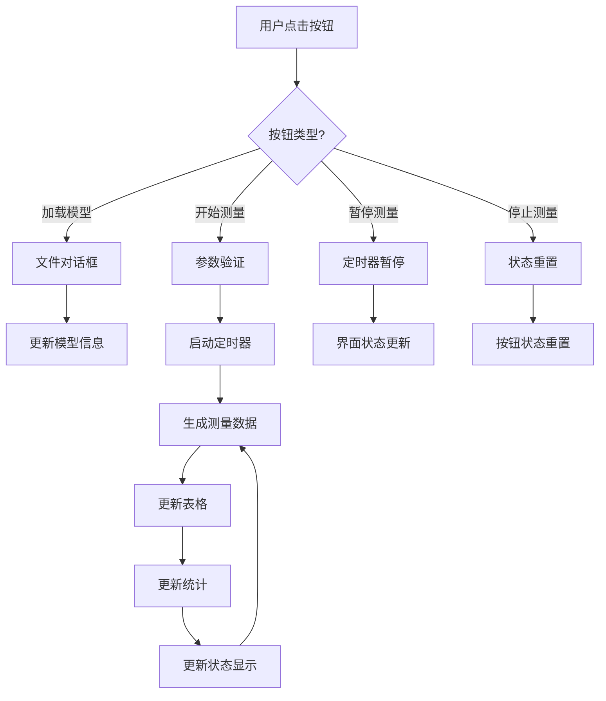

# 技术架构与设计决策

## 🏗️ 系统架构图

```
┌─────────────────────────────────────────────────────────────────┐
│                          用户界面层                                │
│  ┌─────────────────┐  ┌─────────────────┐  ┌─────────────────┐ │
│  │   左侧面板        │  │   中心区域        │  │   右侧面板        │ │
│  │  参数设置&状态    │  │  表格&可视化      │  │  图例&统计        │ │  
│  │                 │  │                 │  │                 │ │
│  │ QFrame(320px)   │  │ QFrame(auto)    │  │ QFrame(320px)   │ │
│  └─────────────────┘  └─────────────────┘  └─────────────────┘ │
└─────────────────────────────────────────────────────────────────┘
                                │
                                ▼
┌─────────────────────────────────────────────────────────────────┐
│                          控制层                                  │
│  ┌─────────────────┐  ┌─────────────────┐  ┌─────────────────┐ │
│  │   事件处理        │  │   状态管理        │  │   定时器控制      │ │
│  │                 │  │                 │  │                 │ │
│  │  信号槽连接       │  │  按钮状态切换     │  │  数据模拟驱动     │ │
│  │  用户交互响应     │  │  测量流程控制     │  │  界面实时更新     │ │
│  └─────────────────┘  └─────────────────┘  └─────────────────┘ │
└─────────────────────────────────────────────────────────────────┘
                                │
                                ▼
┌─────────────────────────────────────────────────────────────────┐
│                          业务逻辑层                               │
│  ┌─────────────────┐  ┌─────────────────┐  ┌─────────────────┐ │
│  │   数据模拟        │  │   参数处理        │  │   统计计算        │ │
│  │                 │  │                 │  │                 │ │
│  │  测量点生成       │  │  输入验证        │  │  误差分析        │ │
│  │  随机数生成       │  │  范围计算        │  │  实时统计        │ │
│  └─────────────────┘  └─────────────────┘  └─────────────────┘ │
└─────────────────────────────────────────────────────────────────┘
                                │
                                ▼
┌─────────────────────────────────────────────────────────────────┐
│                          数据层                                  │
│  ┌─────────────────┐  ┌─────────────────┐  ┌─────────────────┐ │
│  │   配置管理        │  │   样式管理        │  │   数据结构        │ │
│  │                 │  │                 │  │                 │ │
│  │  AppConfig      │  │  StyleManager   │  │  List[float]    │ │
│  │  常量定义        │  │  QSS样式表       │  │  状态变量        │ │
│  └─────────────────┘  └─────────────────┘  └─────────────────┘ │
└─────────────────────────────────────────────────────────────────┘
```

## 🎯 技术选型决策

### GUI框架选择：PySide6

**选择原因**：
- ✅ **跨平台兼容性**: 支持 Windows、macOS、Linux
- ✅ **成熟稳定**: 基于Qt框架，工业级GUI解决方案
- ✅ **丰富的组件**: 内置大量UI组件，满足复杂界面需求
- ✅ **中文支持好**: 完美支持中文显示和输入
- ✅ **文档完善**: 官方文档详尽，社区活跃

**替代方案对比**：
| 框架 | 优点 | 缺点 | 评分 |
|------|------|------|------|
| PySide6/PyQt6 | 功能强大、稳定 | 学习曲线陡峭 | ⭐⭐⭐⭐⭐ |
| Tkinter | Python内置 | 界面简陋 | ⭐⭐ |
| Kivy | 现代化界面 | 生态较小 | ⭐⭐⭐ |
| Electron+Python | Web技术栈 | 资源消耗大 | ⭐⭐⭐ |

### 架构模式：单体架构 + 模块分离

**设计原理**：
```
单一主窗口类 (MainWindow)
├── UI构建模块     # create_*_panel() 方法
├── 事件处理模块   # *_measurement() 方法  
├── 数据处理模块   # update_*() 方法
└── 配置样式模块   # 独立的config.py, styles.py
```

**优点**：
- 🎯 **简单直观**: 新手容易理解和修改
- 🔧 **快速开发**: 减少模块间通信复杂度
- 🐛 **易于调试**: 所有逻辑集中，问题定位容易
- 📖 **代码可读**: 清晰的方法命名和组织结构

**适用场景**：
- 中小型桌面应用
- 功能相对集中的工具软件
- 原型开发和快速迭代

### 数据管理：内存 + 占位符设计

**当前实现**：
```python
# 简单的内存存储
self.errors_list = []           # 误差数据
self.measurement_count = 0      # 计数器
self.current_sequence = 1       # 序号
```

**设计考虑**：
- 🚀 **快速响应**: 内存操作，无I/O延迟
- 🔄 **实时更新**: 适合模拟数据的实时显示  
- 📊 **数据量适中**: 预期数据量不超过10000点
- 🔌 **扩展预留**: DataManager类预留真实数据处理

**未来扩展方向**：
- 数据库存储（SQLite）
- 文件持久化（JSON/CSV）
- 大数据分页显示

### 样式系统：QSS集中管理

**设计策略**：
```python
# styles.py - 集中管理
class StyleManager:
    @staticmethod
    def get_main_stylesheet():
        return """
        /* 所有样式定义 */
        """
        
# 使用方式
self.setStyleSheet(StyleManager.get_main_stylesheet())
```

**优点**：
- 🎨 **样式集中**: 所有界面样式在一个文件中
- 🔄 **易于维护**: 修改样式不需要搜索多个文件
- 🎯 **职责分离**: 样式与逻辑分离
- 📱 **主题支持**: 易于实现多主题切换

### 配置管理：类属性模式

**实现方式**：
```python
# config.py
class AppConfig:
    WINDOW_WIDTH = 1440      # 类属性
    COLORS = {...}           # 字典配置
    
    @classmethod
    def get_color(cls, key):  # 类方法
        return cls.COLORS.get(key)
```

**选择理由**：
- ⚡ **访问快速**: 无需实例化，直接类访问
- 🔒 **类型安全**: IDE可以提供更好的代码提示
- 📝 **可读性好**: 配置项一目了然
- 🛠️ **易于扩展**: 添加新配置项简单

## 🔄 数据流设计

### 用户交互流程



### 数据传递机制

**信号槽连接**：
```python
# 声明式连接
signal.connect(slot)

# 示例
self.button.clicked.connect(self.handler)
self.timer.timeout.connect(self.update_data)
```

**状态同步**：
```python
# 中心化状态管理
def update_ui_state(self):
    """统一更新界面状态"""
    self.start_btn.setEnabled(not self.is_measuring)
    self.pause_btn.setEnabled(self.is_measuring)
    self.status_text.setText(self.get_status_text())
```

### 错误处理策略

**分层错误处理**：
```python
def safe_operation(self):
    """安全操作包装"""
    try:
        # 业务逻辑
        result = self.do_operation()
        
        # 成功反馈
        self.show_success(result)
        
    except ValueError as e:
        # 用户输入错误
        QMessageBox.warning(self, "输入错误", str(e))
        
    except Exception as e:
        # 系统错误
        print(f"系统错误: {e}")
        QMessageBox.critical(self, "系统错误", "请联系开发人员")
```

## 🎯 性能考虑

### 界面响应性

**定时器频率控制**：
```python
# 适中的更新频率
SIMULATION_INTERVAL = 1000  # 1秒，避免界面卡顿

# 表格行数限制
MAX_TABLE_ROWS = 1000  # 防止内存溢出
```

**批量UI更新**：
```python
def batch_update_ui(self):
    """批量更新UI，减少重绘次数"""
    self.table.setUpdatesEnabled(False)  # 暂停重绘
    # ... 批量操作
    self.table.setUpdatesEnabled(True)   # 恢复重绘
```

### 内存管理

**数据清理策略**：
```python
def clean_old_data(self):
    """清理旧数据，保持内存使用合理"""
    if len(self.errors_list) > MAX_DATA_POINTS:
        self.errors_list = self.errors_list[-MAX_DATA_POINTS//2:]
```

## 🔧 可维护性设计

### 代码组织原则

**单一职责**：
- `MainWindow` - 界面构建和交互
- `AppConfig` - 配置管理
- `StyleManager` - 样式管理
- `DataManager` - 数据处理（预留）

**命名规范**：
```python
# 类名：大驼峰
class MainWindow

# 方法名：下划线分隔
def create_left_panel

# 变量名：下划线分隔  
self.current_x_label

# 常量：全大写
WINDOW_WIDTH
```

**注释标准**：
```python
def method_name(self):
    """方法功能描述
    
    详细说明方法的用途、参数和返回值
    """
    # 关键步骤的行内注释
    pass
```

### 扩展性预留

**模块化接口**：
```python
# 为未来扩展预留的接口
class DataProcessor:
    def process_real_data(self, data):
        """处理真实测量数据的接口"""
        pass
    
    def export_results(self, format):
        """导出结果的接口"""
        pass
```

**配置驱动**：
```python
# 通过配置控制功能开关
class AppConfig:
    ENABLE_3D_VIEW = False      # 3D视图开关
    ENABLE_REAL_DATA = False    # 真实数据开关
    DEBUG_MODE = True           # 调试模式开关
```

## 🚀 部署考虑

### 依赖管理

**最小化依赖**：
```python
# 只依赖核心库
requirements.txt:
PySide6>=6.6.0

# 避免不必要的第三方库
```

### 跨平台兼容

**路径处理**：
```python
import os
# 使用 os.path.join 而不是硬编码路径分隔符
config_path = os.path.join(os.path.expanduser("~"), ".app_config")
```

**字体兼容**：
```css
/* QSS中使用字体栈 */
font-family: "PingFang SC", "Microsoft YaHei", "Helvetica", "Arial", sans-serif;
```

## 📊 质量保证

### 测试策略

**手动测试清单**：
- [ ] 界面正常显示
- [ ] 按钮响应正常
- [ ] 数据更新正确
- [ ] 错误处理得当

**自动化测试预留**：
```python
# test_functions.py 为测试脚本预留
class TestMainWindow:
    def test_button_click(self):
        # 测试按钮点击功能
        pass
```

### 代码审查要点

**性能检查**：
- 是否有内存泄漏？
- 定时器是否正确停止？
- 大循环是否有优化？

**安全检查**：
- 用户输入是否验证？
- 文件操作是否安全？
- 异常处理是否完整？

---

## 📈 未来架构演进

### 短期优化 (1-3个月)
- 添加单元测试框架
- 实现配置文件持久化
- 优化大数据量显示性能

### 中期扩展 (3-6个月)  
- 引入 MVP/MVVM 模式
- 添加插件系统
- 实现多语言支持

### 长期规划 (6个月+)
- 微服务架构改造
- Web界面选项
- 云端数据同步

---

*本文档记录了项目的核心技术决策和架构设计，为后续开发提供指导。*
