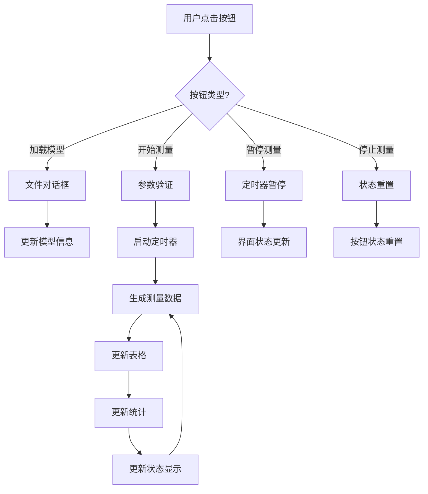

# 技术架构与设计决策

## 🏗️ 系统整体架构

```
┌─────────────────────────────────────────────────────────────────┐
│                        用户界面层 (UI Layer)                      │
│  ┌─────────────────┐  ┌─────────────────┐  ┌─────────────────┐ │
│  │   左侧面板        │  │   中心区域        │  │   右侧面板        │ │
│  │  参数设置&状态    │  │  3D可视化&表格    │  │  统计&图表        │ │  
│  │ QFrame(320px)   │  │ QFrame(auto)    │  │ QFrame(320px)   │ │
│  └─────────────────┘  └─────────────────┘  └─────────────────┘ │
└─────────────────────────────────────────────────────────────────┘
                               │ 信号槽通信
                               ▼
┌─────────────────────────────────────────────────────────────────┐
│                      应用控制层 (Control Layer)                   │
│                    MainWindow (QMainWindow)                     │
│  ┌─────────────────┐  ┌─────────────────┐  ┌─────────────────┐ │
│  │   线程管理        │  │   信号处理        │  │   状态管理        │ │
│  │ Thread Control  │  │ Signal Handling │  │ State Mgmt      │ │
│  │                 │  │                 │  │                 │ │
│  │ start_measurement│  │ on_*_signal     │  │ is_measuring    │ │
│  │ cleanup_threads  │  │ connect slots   │  │ update_ui_*     │ │
│  └─────────────────┘  └─────────────────┘  └─────────────────┘ │
└─────────────────────────────────────────────────────────────────┘
                               │ 多线程架构
            ┌──────────────────┼──────────────────┐
            │                  │                  │
            ▼                  ▼                  ▼
┌─────────────────┐  ┌─────────────────┐  ┌─────────────────┐
│  硬件模拟器线程   │  │  误差分析线程    │  │  数据管理层      │
│HardwareSimulator│  │ AnalysisWorker  │  │  DataManager    │
│   (QThread)     │  │   (QThread)     │  │   (QObject)     │
│                 │  │                 │  │                 │
│ 测量数据生成      │  │ 实时误差计算     │  │ 配置管理         │
│ 文件写入操作      │  │ 统计数据更新     │  │ 样式管理         │
│ 进度信号发射      │  │ 文件监控处理     │  │ 数据结构定义     │
└─────────────────┘  └─────────────────┘  └─────────────────┘
```

## 🧵 多线程架构设计

### 线程分工明确

```
主线程 (UI Thread)
├── 界面渲染和用户交互
├── 信号接收和界面更新
└── 线程管理和生命周期控制

硬件模拟器线程 (Producer Thread)  
├── 理论数据处理和筛选
├── 测量误差模拟算法
├── CSV文件写入操作
└── 测量进度信号发射

误差分析线程 (Consumer Thread)
├── 实时文件监控 (CSV文件变化)
├── 坐标转换计算 (柱坐标↔笛卡尔)
├── 误差计算和统计分析
└── 可视化数据准备
```

### 线程通信机制

**信号槽架构**：
```python
# 硬件模拟器 → 主窗口
HardwareSimulator.measurement_point.connect(MainWindow.on_measurement_point)
HardwareSimulator.progress_updated.connect(MainWindow.on_progress_updated)
HardwareSimulator.measurement_finished.connect(MainWindow.on_measurement_finished)

# 误差分析器 → 主窗口  
AnalysisWorker.analysis_result.connect(MainWindow.on_analysis_result)
AnalysisWorker.statistics_updated.connect(MainWindow.on_statistics_updated)
AnalysisWorker.error_data_updated.connect(MainWindow.on_error_data_updated)
```

**数据流向**：
```
理论数据 → HardwareSimulator → CSV文件 → AnalysisWorker → 界面更新
    ↓              ↓                ↓              ↓            ↓
CSV加载    测量点模拟        实时写入      误差计算      3D可视化
```

## 🎯 核心算法实现

### 测量点生成算法

**循环旋转模式** (hardware_simulator.py):
```python
def filter_measurement_points(self) -> pd.DataFrame:
    # 算法：模拟真实硬件旋转测量模式
    # 1. 按X坐标分组
    # 2. 每个X位置进行360°旋转
    # 3. 按角度步长采样点
    # 优势：符合实际测量轨迹，提高仿真真实度
```

### 误差模型算法

**组合误差生成**:
```python
def simulate_measurement_error(self, ideal_radius, x_pos, angle_deg):
    # 三重误差叠加模型:
    # 1. 系统性误差：固定偏移 (±0.02mm)
    # 2. 随机噪声：高斯分布 (σ=0.05mm)  
    # 3. 位置相关误差：基于角度和位置的周期性误差
    return measured_radius
```

### 坐标转换算法

**柱坐标 ↔ 笛卡尔坐标**:
```python
def convert_to_cartesian(self, x, angle_deg, radius):
    # 标准柱坐标转换公式
    # x = x (不变)
    # y = radius * cos(angle)  
    # z = radius * sin(angle)
    # 注意：角度统一使用弧度制计算
```

## 📊 数据处理流程

### 实时数据流水线

```
步骤1: 数据筛选
理论点云 → 按测量参数筛选 → 测量点集合

步骤2: 误差生成  
测量点 → 添加模拟误差 → 测量数据

步骤3: 文件写入
测量数据 → CSV格式写入 → live_measurement.csv

步骤4: 文件监控
文件大小变化 → 触发分析 → 读取新数据行

步骤5: 误差计算
测量数据 + 理论数据 → 误差计算 → 统计更新

步骤6: 界面更新
分析结果 → 信号发射 → UI组件更新
```

### 查找索引优化

**理论数据快速查找**:
```python
# 创建索引结构，提高查找效率
self.theoretical_lookup = {
    (x_mm, angle_key): theoretical_point
    for x_mm, angle_key, theoretical_point in processed_data
}

# 角度量化策略：避免浮点数精度问题
angle_key = round(angle_deg / 0.1) * 0.1
```

## 🎯 技术选型决策

### GUI框架：PySide6

**选择理由**：
- ✅ **工业级稳定性**: Qt框架40+年历史，经过工业验证
- ✅ **多线程支持**: 原生QThread支持，信号槽线程安全
- ✅ **3D集成能力**: 可集成matplotlib等可视化库  
- ✅ **完整中文支持**: 国际化(i18n)完善
- ✅ **丰富的组件**: 满足复杂工业软件界面需求

### 数据处理：Pandas + NumPy

**技术栈优势**：
- 📊 **高效数据操作**: Pandas处理结构化数据
- 🧮 **数值计算优化**: NumPy底层C实现，性能优异
- 📈 **可视化集成**: 无缝对接matplotlib绘图
- 🔄 **格式支持广泛**: CSV, Excel等格式原生支持

### 并发模型：基于信号槽的Producer-Consumer

**架构优势**：
- 🧵 **线程安全**: Qt信号槽机制保证线程安全通信
- � **松耦合设计**: 生产者消费者分离，易于扩展
- ⚡ **实时响应**: 异步处理，界面永不阻塞
- 🐛 **容错机制**: 线程异常隔离，不影响主界面
- 🚀 **快速响应**: 内存操作，无I/O延迟
- 🔄 **实时更新**: 适合模拟数据的实时显示  
- 📊 **数据量适中**: 预期数据量不超过10000点
- 🔌 **扩展预留**: DataManager类预留真实数据处理

**未来扩展方向**：
- 数据库存储（SQLite）
- 文件持久化（JSON/CSV）
- 大数据分页显示

### 样式系统：QSS集中管理

**设计策略**：
```python
# styles.py - 集中管理
class StyleManager:
    @staticmethod
    def get_main_stylesheet():
        return """
        /* 所有样式定义 */
        """
        
# 使用方式
self.setStyleSheet(StyleManager.get_main_stylesheet())
```

**优点**：
- 🎨 **样式集中**: 所有界面样式在一个文件中
- 🔄 **易于维护**: 修改样式不需要搜索多个文件
- 🎯 **职责分离**: 样式与逻辑分离
- 📱 **主题支持**: 易于实现多主题切换

### 配置管理：类属性模式

**实现方式**：
```python
# config.py
class AppConfig:
    WINDOW_WIDTH = 1440      # 类属性
    COLORS = {...}           # 字典配置
    
    @classmethod
    def get_color(cls, key):  # 类方法
        return cls.COLORS.get(key)
```

**选择理由**：
- ⚡ **访问快速**: 无需实例化，直接类访问
- 🔒 **类型安全**: IDE可以提供更好的代码提示
- 📝 **可读性好**: 配置项一目了然
- 🛠️ **易于扩展**: 添加新配置项简单

## 🔄 数据流设计

### 用户交互流程



### 数据传递机制

**信号槽连接**：
```python
# 声明式连接
signal.connect(slot)

# 示例
self.button.clicked.connect(self.handler)
self.timer.timeout.connect(self.update_data)
```

**状态同步**：
```python
# 中心化状态管理
def update_ui_state(self):
    """统一更新界面状态"""
    self.start_btn.setEnabled(not self.is_measuring)
    self.pause_btn.setEnabled(self.is_measuring)
    self.status_text.setText(self.get_status_text())
```

### 错误处理策略

**分层错误处理**：
```python
def safe_operation(self):
    """安全操作包装"""
    try:
        # 业务逻辑
        result = self.do_operation()
        
        # 成功反馈
        self.show_success(result)
        
    except ValueError as e:
        # 用户输入错误
        QMessageBox.warning(self, "输入错误", str(e))
        
    except Exception as e:
        # 系统错误
        print(f"系统错误: {e}")
        QMessageBox.critical(self, "系统错误", "请联系开发人员")
```

## 🎯 性能考虑

### 界面响应性

**定时器频率控制**：
```python
# 适中的更新频率
SIMULATION_INTERVAL = 1000  # 1秒，避免界面卡顿

# 表格行数限制
MAX_TABLE_ROWS = 1000  # 防止内存溢出
```

**批量UI更新**：
```python
def batch_update_ui(self):
    """批量更新UI，减少重绘次数"""
    self.table.setUpdatesEnabled(False)  # 暂停重绘
    # ... 批量操作
    self.table.setUpdatesEnabled(True)   # 恢复重绘
```

### 内存管理

**数据清理策略**：
```python
def clean_old_data(self):
    """清理旧数据，保持内存使用合理"""
    if len(self.errors_list) > MAX_DATA_POINTS:
        self.errors_list = self.errors_list[-MAX_DATA_POINTS//2:]
```

## 🔧 可维护性设计

### 代码组织原则

**单一职责**：
- `MainWindow` - 界面构建和交互
- `AppConfig` - 配置管理
- `StyleManager` - 样式管理
- `DataManager` - 数据处理（预留）

**命名规范**：
```python
# 类名：大驼峰
class MainWindow

# 方法名：下划线分隔
def create_left_panel

# 变量名：下划线分隔  
self.current_x_label

# 常量：全大写
WINDOW_WIDTH
```

**注释标准**：
```python
def method_name(self):
    """方法功能描述
    
    详细说明方法的用途、参数和返回值
    """
    # 关键步骤的行内注释
    pass
```

### 扩展性预留

**模块化接口**：
```python
# 为未来扩展预留的接口
class DataProcessor:
    def process_real_data(self, data):
        """处理真实测量数据的接口"""
        pass
    
    def export_results(self, format):
        """导出结果的接口"""
        pass
```

**配置驱动**：
```python
# 通过配置控制功能开关
class AppConfig:
    ENABLE_3D_VIEW = False      # 3D视图开关
    ENABLE_REAL_DATA = False    # 真实数据开关
    DEBUG_MODE = True           # 调试模式开关
```

## 🚀 部署考虑

### 依赖管理

**最小化依赖**：
```python
# 只依赖核心库
requirements.txt:
PySide6>=6.6.0

# 避免不必要的第三方库
```

### 跨平台兼容

**路径处理**：
```python
import os
# 使用 os.path.join 而不是硬编码路径分隔符
config_path = os.path.join(os.path.expanduser("~"), ".app_config")
```

**字体兼容**：
```css
/* QSS中使用字体栈 */
font-family: "PingFang SC", "Microsoft YaHei", "Helvetica", "Arial", sans-serif;
```

## 📊 质量保证

### 测试策略

**手动测试清单**：
- [ ] 界面正常显示
- [ ] 按钮响应正常
- [ ] 数据更新正确
- [ ] 错误处理得当

**自动化测试预留**：
```python
# test_functions.py 为测试脚本预留
class TestMainWindow:
    def test_button_click(self):
        # 测试按钮点击功能
        pass
```

### 代码审查要点

**性能检查**：
- 是否有内存泄漏？
- 定时器是否正确停止？
- 大循环是否有优化？

**安全检查**：
- 用户输入是否验证？
- 文件操作是否安全？
- 异常处理是否完整？

---

## 📈 未来架构演进

### 短期优化 (1-3个月)
- 添加单元测试框架
- 实现配置文件持久化
- 优化大数据量显示性能

### 中期扩展 (3-6个月)  
- 引入 MVP/MVVM 模式
- 添加插件系统
- 实现多语言支持

### 长期规划 (6个月+)
- 微服务架构改造
- Web界面选项
- 云端数据同步

---

*本文档记录了项目的核心技术决策和架构设计，为后续开发提供指导。*
