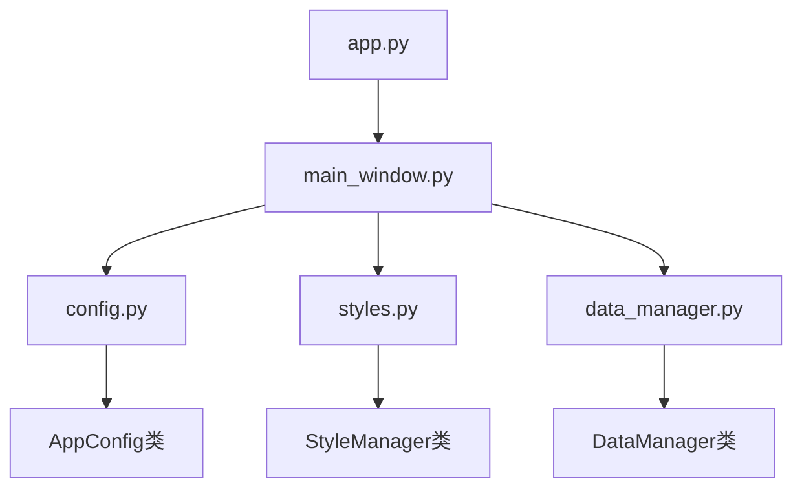
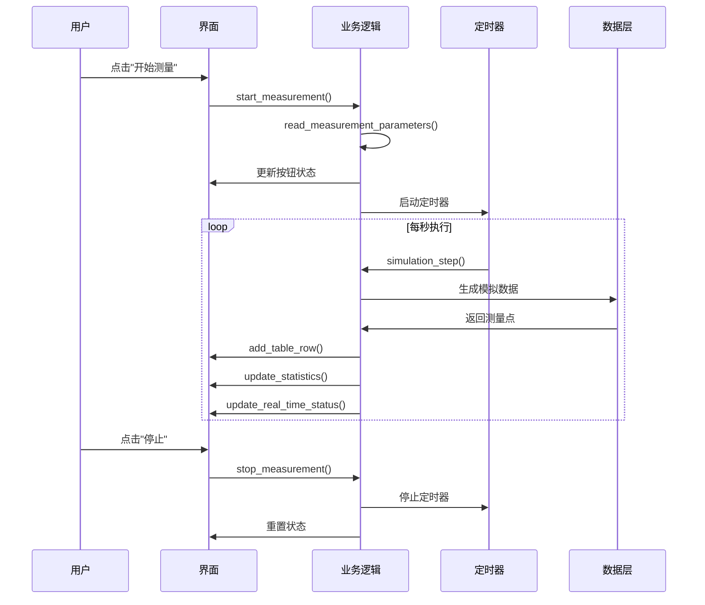

# 模具曲面精度分析系统 - 开发文档

## 📚 目录
- [项目概览](#项目概览)
- [快速开始](#快速开始)
- [系统架构](#系统架构)
- [代码结构详解](#代码结构详解)
- [核心模块说明](#核心模块说明)
- [界面组件映射](#界面组件映射)
- [数据流程](#数据流程)
- [开发规范](#开发规范)
- [扩展指南](#扩展指南)
- [常见问题](#常见问题)

## 📋 项目概览

## 📋 项目概览

### 项目背景
模具曲面精度分析系统是一个基于 Python 和 PySide6 开发的桌面应用程序，专门用于模拟硬件测量设备进行实时数据采集，并通过多线程架构实现测量数据与理论CAD模型的对比分析，计算和可视化模具表面精度误差。

### 核心技术栈
- **GUI框架**: PySide6 (Qt for Python 6.6.0+)
- **多线程**: QThread 实现硬件模拟和误差分析
- **数据处理**: pandas + NumPy 数值计算  
- **可视化**: matplotlib 3D绘图和统计图表
- **样式系统**: Qt Style Sheets (QSS) 现代化界面
- **开发模式**: 面向对象编程 + 信号槽模式
- **环境管理**: conda 虚拟环境

### 系统特色
- 🧵 **真正的多线程架构**: HardwareSimulator + AnalysisWorker 双线程并行
- 📊 **实时数据处理**: CSV文件监控 + 增量数据分析
- 🎯 **高精度误差模拟**: 三层误差模型 (系统+随机+位置)
- 🗺️ **坐标系统转换**: 柱坐标 ↔ 笛卡尔坐标精确转换
- ⚡ **性能优化**: O(1)理论数据查找 + 缓存机制
- 完整的交互逻辑实现

## 🚀 快速开始

### 环境准备
1. **安装 conda 环境**
   ```bash
   # 检查是否已有 pyside-env 环境
   conda env list
   
   # 如果没有，创建新环境
   conda create -n pyside-env python=3.9
   conda activate pyside-env
   conda install pip
   ```

2. **安装 PySide6**
   ```bash
   conda activate pyside-env
   pip install PySide6>=6.6.0
   ```

### 项目运行
```bash
# 1. 激活环境
conda activate pyside-env

# 2. 进入项目目录
cd /path/to/mold-surface-inspector

# 3. 运行应用程序
python app.py

# 或使用运行脚本
./run.sh
```

### 验证安装
运行后应该看到：
- 主窗口正常显示
- 三栏布局清晰
- 按钮可以点击
- 控制台没有错误信息

## 🏗️ 系统架构

### 架构概览
```
┌─────────────────────────────────────────────────────────┐
│                    应用程序层                              │
│  ┌─────────────┐  ┌─────────────┐  ┌─────────────┐    │
│  │   主窗口     │  │   配置管理   │  │   样式管理   │    │
│  │ MainWindow  │  │   Config    │  │   Styles    │    │
│  └─────────────┘  └─────────────┘  └─────────────┘    │
└─────────────────────────────────────────────────────────┘
┌─────────────────────────────────────────────────────────┐
│                    业务逻辑层                              │
│  ┌─────────────┐  ┌─────────────┐  ┌─────────────┐    │
│  │   数据管理   │  │   文件处理   │  │   计算逻辑   │    │
│  │ DataManager │  │ FileHandler │  │ Calculator  │    │
│  └─────────────┘  └─────────────┘  └─────────────┘    │
└─────────────────────────────────────────────────────────┘
┌─────────────────────────────────────────────────────────┐
│                    界面组件层                              │
│  ┌─────────────┐  ┌─────────────┐  ┌─────────────┐    │
│  │   左侧面板   │  │   中心区域   │  │   右侧面板   │    │
│  │ LeftPanel   │  │ CenterArea  │  │ RightPanel  │    │
│  └─────────────┘  └─────────────┘  └─────────────┘    │
└─────────────────────────────────────────────────────────┘
```

### 设计模式
- **MVC模式**: 分离界面、逻辑和数据
- **单例模式**: 配置管理器
- **观察者模式**: 信号槽机制
- **工厂模式**: 组件创建

## 📁 代码结构详解

### 文件组织
```
mold-surface-inspector/
├── 📄 app.py                 # 🚪 应用程序入口
├── 📄 main_window.py         # 🏠 主窗口类（核心文件）
├── 📄 config.py              # ⚙️ 配置管理
├── 📄 styles.py              # 🎨 样式管理  
├── 📄 data_manager.py        # 📊 数据管理（预留）
├── 📄 test_functions.py      # 🧪 功能测试
├── 📄 run.sh                 # 🔧 运行脚本
├── 📄 requirements.txt       # 📦 依赖列表
├── 📄 FUNCTIONS.md           # 📖 功能说明
├── 📄 DEV_GUIDE.md           # 📚 开发文档（本文件）
├── 📄 页面 1.html           # 🖼️ UI原型参考
└── 📄 README.md             # 📋 项目说明
```

### 核心文件关系


## 🧩 核心模块说明

### 1. app.py - 应用入口
```python
# 文件作用：应用程序启动入口
# 代码行数：约10行
# 主要功能：导入主窗口并启动应用
```

**关键代码解析**：
```python
from main_window import main  # 导入主函数
if __name__ == "__main__":
    main()  # 启动应用程序
```

### 2. main_window.py - 主窗口类（🔥核心文件）
```python
# 文件作用：主窗口类实现
# 代码行数：约600行
# 主要功能：UI构建、交互逻辑、事件处理
```

#### 类结构图
```
MainWindow
├── __init__()           # 初始化
├── init_ui()           # UI初始化
├── create_menu_bar()   # 创建菜单栏
├── create_toolbar()    # 创建工具栏
├── create_central_widget() # 创建中央部件
│   ├── create_left_panel()    # 左侧面板
│   ├── create_center_panel()  # 中心面板
│   └── create_right_panel()   # 右侧面板
├── setup_connections() # 信号连接
└── 占位符函数群
    ├── load_model()         # 加载模型
    ├── start_measurement()  # 开始测量
    ├── pause_measurement()  # 暂停测量
    ├── stop_measurement()   # 停止测量
    └── simulation_step()    # 模拟步骤
```

#### 重要方法详解

**UI创建方法**：
```python
def create_left_panel(self):
    """创建左侧面板 - 测量设置与控制"""
    # 返回：QFrame对象
    # 包含：模型信息、参数设置、状态监控
```

**交互方法**：
```python
def start_measurement(self):
    """开始测量功能"""
    # 1. 读取参数
    # 2. 更新按钮状态
    # 3. 启动定时器
    # 4. 更新状态指示器
```

### 3. config.py - 配置管理
```python
# 文件作用：集中管理应用配置
# 设计模式：类属性配置
# 主要内容：尺寸、颜色、常量
```

**配置类结构**：
```python
class AppConfig:
    # 应用信息
    APP_NAME = "模具曲面精度分析系统"
    APP_VERSION = "2.1"
    
    # 界面尺寸
    WINDOW_WIDTH = 1440
    WINDOW_HEIGHT = 900
    
    # 颜色配置
    COLORS = {
        'error_positive_high': '#ef4444',
        'error_normal': '#10b981',
        # ...
    }
```

### 4. styles.py - 样式管理
```python
# 文件作用：QSS样式表管理
# 设计思路：集中化样式管理
# 样式覆盖：按钮、表格、面板等
```

**样式管理器结构**：
```python
class StyleManager:
    @staticmethod
    def get_main_stylesheet():
        """返回完整的QSS样式表"""
        
    @staticmethod  
    def get_color_block_style(color):
        """生成颜色块样式"""
```

### 5. data_manager.py - 数据管理（预留）
```python
# 文件作用：数据处理和管理
# 当前状态：已实现基础结构，未在主程序中使用
# 扩展用途：真实数据处理、文件I/O、计算逻辑
```

## 🖥️ 界面组件映射

### 组件层级结构
```
QMainWindow (主窗口)
├── QMenuBar (菜单栏)
├── QToolBar (工具栏) 
└── QWidget (中央部件)
    └── QHBoxLayout (水平布局)
        ├── QFrame (左侧面板, 320px)
        │   ├── 理论模型信息组
        │   ├── 测量参数设置组  
        │   └── 实时状态监控组
        ├── QFrame (中心面板, 自适应)
        │   ├── QWidget (3D可视化占位符)
        │   └── QTableWidget (数据表格)
        └── QFrame (右侧面板, 320px)
            ├── 颜色图例组
            ├── 误差统计组
            └── 图表占位符组
```

### 关键组件引用
在 `MainWindow` 类中，重要组件都有实例引用：

```python
class MainWindow(QMainWindow):
    def __init__(self):
        # 工具栏按钮
        self.load_model_btn = QPushButton("📁 加载模型")
        self.start_measure_btn = QPushButton("▶ 开始测量")
        self.pause_btn = QPushButton("⏸ 暂停")
        self.stop_btn = QPushButton("⏹ 停止")
        
        # 输入框
        self.x_min_input = QLineEdit()
        self.x_max_input = QLineEdit()
        self.x_step_input = QLineEdit()
        self.rot_step_input = QLineEdit()
        
        # 显示标签
        self.current_x_label = QLabel()
        self.current_angle_label = QLabel()
        self.status_text = QLabel()
        
        # 表格
        self.data_table = QTableWidget()
```

### 信号槽连接
所有交互组件都通过信号槽机制连接到对应的处理函数：

```python
def setup_connections(self):
    """设置信号连接"""
    self.load_model_btn.clicked.connect(self.load_model)
    self.start_measure_btn.clicked.connect(self.start_measurement)
    self.pause_btn.clicked.connect(self.pause_measurement)
    self.stop_btn.clicked.connect(self.stop_measurement)
    # ...
```

## 📊 数据流程

### 测量流程图


### 数据结构
```python
# 测量点数据结构
@dataclass
class MeasurementPoint:
    sequence: int           # 序号
    x_coord: float         # X坐标
    angle: float           # 角度
    measured_value: float  # 测量值
    theoretical_value: float # 理论值
    error: float           # 误差
    status: str            # 状态

# 统计数据结构
statistics = {
    'max_error': float,        # 最大误差
    'min_error': float,        # 最小误差
    'avg_error': float,        # 平均误差
    'std_error': float,        # 标准差
    'total_points': int,       # 总点数
    'qualified_points': int,   # 合格点数
}
```

## 📏 开发规范

### 代码风格
1. **命名规范**
   ```python
   # 类名：大驼峰
   class MainWindow(QMainWindow):
   
   # 方法名：下划线
   def create_left_panel(self):
   
   # 变量名：下划线
   self.current_x_label = QLabel()
   
   # 常量：全大写
   WINDOW_WIDTH = 1440
   ```

2. **注释规范**
   ```python
   def create_toolbar(self):
       """创建工具栏"""  # 方法说明
       
   # 工具栏按钮组
   self.load_model_btn = QPushButton("📁 加载模型")  # 行内注释
   ```

3. **文件组织**
   - 每个文件开头包含编码和描述
   - 导入语句分组（标准库、第三方、本地）
   - 类和函数之间空两行

### Qt/PySide6 使用规范

1. **组件命名**
   ```python
   # 好的命名：体现用途
   self.start_measure_btn = QPushButton()
   self.data_table = QTableWidget()
   
   # 不推荐：只有类型
   self.button1 = QPushButton()
   self.table = QTableWidget()
   ```

2. **信号连接**
   ```python
   # 集中在 setup_connections() 方法中
   def setup_connections(self):
       self.button.clicked.connect(self.handler)
   ```

3. **样式应用**
   ```python
   # 使用 ObjectName + QSS
   button.setObjectName("primaryButton")
   # 在 QSS 中定义样式
   """
   QPushButton#primaryButton {
       background-color: #2563eb;
   }
   """
   ```

### 错误处理规范
```python
def read_measurement_parameters(self):
    """参数读取示例"""
    try:
        x_min = float(self.x_min_input.text())
        # ... 处理逻辑
    except ValueError as e:
        print(f"参数读取错误: {e}")
        QMessageBox.warning(self, "参数错误", "请检查输入参数")
```

## 🔧 扩展指南

### 添加新功能的步骤

#### 1. 添加新的UI组件
```python
def create_new_group(self):
    """创建新功能组"""
    group_widget = QWidget()
    layout = QVBoxLayout(group_widget)
    
    # 添加标题
    title = QLabel("新功能")
    title.setObjectName("groupTitle")
    layout.addWidget(title)
    
    # 添加控件
    new_button = QPushButton("新按钮")
    new_button.setObjectName("primaryButton")
    layout.addWidget(new_button)
    
    # 保存引用用于后续操作
    self.new_button = new_button
    
    return group_widget
```

#### 2. 添加信号连接
```python
def setup_connections(self):
    # ...existing connections...
    self.new_button.clicked.connect(self.new_function)
```

#### 3. 实现功能逻辑
```python
def new_function(self):
    """新功能实现"""
    print("=== 新功能执行 ===")
    
    # 读取用户输入
    # 执行业务逻辑  
    # 更新界面显示
    # 错误处理
    
    QMessageBox.information(self, "提示", "新功能执行完成")
```

#### 4. 添加配置项
```python
# 在 config.py 中
class AppConfig:
    # 新功能相关配置
    NEW_FEATURE_ENABLED = True
    NEW_FEATURE_TIMEOUT = 5000
```

#### 5. 添加样式
```python
# 在 styles.py 中
def get_main_stylesheet(self):
    return """
    /* ...existing styles... */
    
    /* 新功能样式 */
    QPushButton#newFeatureButton {
        background-color: #8b5cf6;
        color: white;
    }
    """
```

### 常见扩展场景

#### 场景1：添加新的数据导入功能
1. **UI扩展**：在左侧面板添加"导入数据"按钮
2. **功能实现**：使用`QFileDialog`选择数据文件
3. **数据处理**：解析文件内容并填充到表格
4. **错误处理**：文件格式验证和错误提示

#### 场景2：添加数据导出功能  
1. **UI扩展**：在工具栏添加"导出报告"按钮
2. **功能实现**：收集当前数据和统计信息
3. **文件生成**：生成Excel或PDF报告
4. **用户反馈**：显示导出成功提示

#### 场景3：添加3D可视化
1. **依赖安装**：添加3D图形库（如matplotlib、pyqtgraph）
2. **UI替换**：替换中心区域的占位符
3. **数据绑定**：将测量数据映射到3D图形
4. **交互控制**：添加视图控制功能

### 性能优化建议

#### 1. 大数据量处理
```python
def add_table_row_optimized(self, data):
    """优化的表格添加方法"""
    # 限制显示行数
    max_rows = 1000
    if self.data_table.rowCount() > max_rows:
        self.data_table.removeRow(0)
    
    # 批量更新
    self.data_table.insertRow(self.data_table.rowCount())
    # ... 添加数据
```

#### 2. 界面响应性
```python
def long_running_task(self):
    """长时间运行的任务"""
    # 使用 QThread 避免界面卡顿
    from PySide6.QtCore import QThread
    
    worker = QThread()
    # 将任务移到后台线程
```

## ❓ 常见问题

### 开发环境问题

**Q1: 提示 PySide6 模块找不到**
```bash
# 解决方案
conda activate pyside-env
pip install PySide6
```

**Q2: 界面显示异常**
```python
# 检查样式表是否正确加载
def setup_style(self):
    style = StyleManager.get_main_stylesheet()
    print("样式长度:", len(style))  # 调试输出
    self.setStyleSheet(style)
```

**Q3: 信号槽连接失败**
```python
# 确保在对象创建后连接
def setup_connections(self):
    # 检查对象是否存在
    if hasattr(self, 'start_measure_btn'):
        self.start_measure_btn.clicked.connect(self.start_measurement)
```

### 功能扩展问题

**Q4: 如何添加新的配置项？**
1. 在 `config.py` 中添加配置常量
2. 在需要的地方引用 `AppConfig.NEW_CONFIG`
3. 如果是用户可配置的，考虑添加设置界面

**Q5: 如何处理复杂的数据结构？**
1. 使用 `dataclass` 定义数据结构
2. 在 `data_manager.py` 中实现数据处理逻辑
3. 通过信号槽机制更新界面

**Q6: 如何调试界面布局问题？**
```python
# 添加调试边框
widget.setStyleSheet("border: 1px solid red;")

# 打印尺寸信息
print(f"Widget size: {widget.size()}")
```

### 部署和分发

**Q7: 如何打包成可执行文件？**
```bash
# 使用 PyInstaller
pip install pyinstaller
pyinstaller --onefile --windowed app.py
```

**Q8: 如何处理不同操作系统的兼容性？**
- 使用相对路径
- 避免系统特定的API
- 测试多个平台

## 📚 参考资源

### 官方文档
- [PySide6 官方文档](https://doc.qt.io/qtforpython/)
- [Qt Style Sheets 参考](https://doc.qt.io/qt-6/stylesheet-reference.html)

### 学习资源
- [Qt Designer 教程](https://doc.qt.io/qt-6/qtdesigner-manual.html)
- [Python GUI 编程最佳实践](https://realpython.com/python-gui-programming/)

### 社区支持
- [Qt Forum](https://forum.qt.io/)
- [Stack Overflow - PySide6 标签](https://stackoverflow.com/questions/tagged/pyside6)

---

## 👥 贡献指南

如果您要对此项目进行二次开发，请遵循以下流程：

1. **理解现有架构**：仔细阅读本文档和代码注释
2. **设置开发环境**：按照快速开始指南配置环境
3. **功能设计**：在实现前先设计功能架构
4. **渐进式开发**：小步骤迭代，及时测试
5. **文档更新**：修改代码后更新相关文档

**联系方式**：
- 技术讨论：[在此添加联系方式]
- 问题反馈：[在此添加Issue地址]

---

*本文档最后更新：2025年8月9日*
