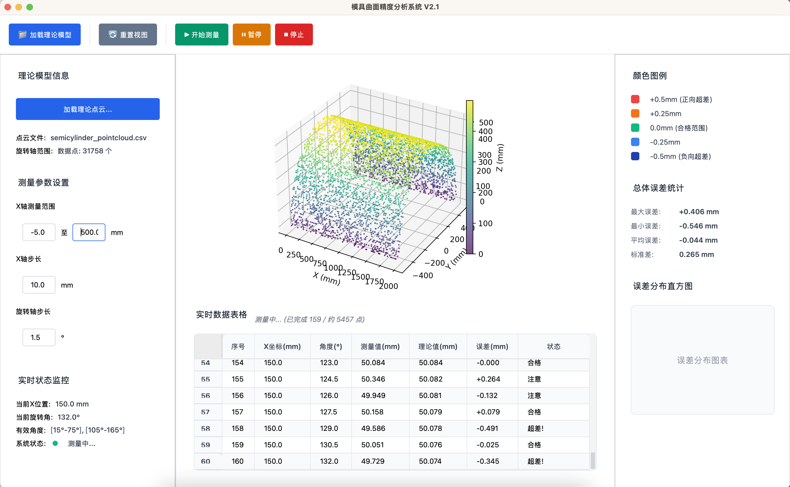

# 模具曲面精度分析系统

一个基于 Python 和 PySide6 开发的桌面应用程序，用于加载理论CAD模型信息和实时测量数据，通过对比分析两者差异来计算和可视化模具的表面精度误差。

## 🖼️ 系统界面



*系统主界面展示了完整的三栏布局设计：*
- **左侧面板**: 理论模型信息、测量参数设置、实时状态监控
- **中央区域**: 3D可视化窗口和实时数据表格
- **右侧面板**: 颜色图例、误差统计分析、误差分布图表

## 功能特性

- **理论模型管理**: 支持加载和管理CAD模型文件
- **实时测量控制**: 提供测量参数设置和过程控制
- **数据可视化**: 实时显示测量数据和误差分析
- **统计分析**: 提供误差统计和分布图表
- **现代化界面**: 采用现代化设计，界面清晰美观

## 系统要求

- Python 3.8+
- PySide6 6.6.0+
- macOS / Windows / Linux

## 安装和运行
### 环境要求

- Python 3.8+
- conda 环境管理器
- 已创建的 pyside-env 环境，包含 PySide6

### 1. 激活 conda 环境

```bash
conda activate pyside-env
```

### 2. 安装依赖（如果需要）

```bash
pip install -r requirements.txt
```

### 3. 运行应用程序

```bash
python app.py
```

或者使用提供的运行脚本：

```bash
./run.sh
```

或者直接运行主窗口模块：

```bash
python main_window.py
```

## 📚 完整文档导航

本项目提供了完整的开发文档体系，帮助不同需求的开发者快速上手：

### 🎯 新手必读
- **[⚡ 快速上手指南](QUICK_START.md)** - 15分钟快速了解项目
- **[🏠 项目功能说明](FUNCTIONS.md)** - 详细的功能特性介绍

### 🔧 开发人员
- **[📚 完整开发文档](DEV_GUIDE.md)** - 全面的开发指南和规范
- **[📖 API 参考手册](API_REFERENCE.md)** - 详细的类和方法说明
- **[🏗️ 技术架构文档](ARCHITECTURE.md)** - 系统架构和设计决策

### 📁 文档结构
```
📚 文档系统
├── 📋 README.md          # 项目总览（当前文件）
├── ⚡ QUICK_START.md     # 快速上手（15分钟）
├── 🏠 FUNCTIONS.md       # 功能说明
├── 📚 DEV_GUIDE.md       # 开发指南（完整版）
├── 📖 API_REFERENCE.md   # API参考手册
└── 🏗️ ARCHITECTURE.md    # 技术架构文档
```

### 🎯 按需阅读建议

| 你的角色 | 推荐阅读顺序 |
|---------|-------------|
| **新接手开发者** | README → QUICK_START → DEV_GUIDE → API_REFERENCE |
| **功能了解者** | README → FUNCTIONS |
| **架构设计者** | README → ARCHITECTURE → DEV_GUIDE |
| **API使用者** | API_REFERENCE → QUICK_START |

```
mold-surface-inspector/
├── app.py                 # 应用程序启动入口
├── main_window.py         # 主窗口类实现（包含所有交互功能）
├── config.py              # 配置管理模块
├── styles.py              # QSS样式管理模块  
├── data_manager.py        # 数据管理模块
├── test_functions.py      # 功能测试脚本
├── run.sh                 # 便捷运行脚本
├── requirements.txt       # 项目依赖
├── FUNCTIONS.md           # 功能详细说明文档
├── 页面 1.html           # UI原型参考
└── README.md             # 项目说明文档
```

## 界面功能

### 主窗口布局

- **菜单栏**: 文件、视图、工具、帮助等菜单
- **工具栏**: 常用功能按钮（加载模型、开始测量等）
- **三栏布局**:
  - **左侧面板**: 理论模型信息、测量参数设置、实时状态监控
  - **中心区域**: 3D可视化窗口、实时数据表格
  - **右侧面板**: 颜色图例、误差统计、分布图表

### 主要功能模块

1. **CAD模型管理**
   - 支持加载 CAD 文件（.step, .stp, .iges, .igs, .stl）
   - 显示模型基本信息和参数范围
   - 文件路径控制台输出

2. **测量过程控制** ⭐
   - 开始/暂停/停止测量功能
   - 智能按钮状态管理
   - 实时状态指示器
   - 测量参数读取和验证

3. **实时数据模拟** ⭐
   - 自动生成模拟测量数据
   - 实时更新数据表格
   - 自动滚动到最新数据
   - 状态颜色编码（合格/注意/超差）

4. **统计分析** ⭐
   - 实时计算最大/最小/平均误差
   - 标准差统计
   - 进度监控
   - 颜色编码图例

5. **用户界面交互**
   - 完整的信号槽连接
   - 友好的消息提示
   - 参数输入验证
   - 响应式按钮状态

## 技术特点

- **面向对象设计**: 使用 OOP 方式组织代码结构
- **模块化架构**: 清晰的功能模块划分
- **响应式布局**: 支持窗口大小调整
- **现代化样式**: 使用 QSS 样式表美化界面
- **中文界面**: 完全支持中文显示和注释

## 开发说明

本项目采用 PySide6 框架开发，精确复刻了原型设计的界面布局和样式。代码结构清晰，注释详细，便于后续功能扩展和维护。

### 主要技术栈

- **GUI框架**: PySide6
- **编程语言**: Python 3.8+
- **样式系统**: Qt Style Sheets (QSS)
- **布局管理**: QHBoxLayout, QVBoxLayout, QGridLayout

## 许可证

本项目采用 MIT 许可证，详情请查看 LICENSE 文件。

## 联系方式

如有问题或建议，请通过以下方式联系：
- 邮箱: [your-email@example.com]
- 项目地址: [GitHub Repository URL]
